# Clash Royale Web Aplicación 

### Autores: 
   - Daniel de la Cruz Prieto.  [dcruzp](https://github.com/dcruzp/)
   - Frank Adrian Perez Morales. [frankadrian98](https://github.com/frankadrian98/)
   - Camilo Rodriguez Velázquez.  [ErichKrausse](https://github.com/ErichKrausse/) 

    
### Estructura del proyecto por carpetas 

- ### Controllers
    
    En esta carpeta están los controladores de la aplicación. 

    ```
        Controllers
            |-JugadorController.cs
            |-ClanController.cs
            |-CartaController.cs
            |-DesafioController.cs
            |-GuerraDeClanesController.cs 
    ``` 
    
    **Jugador Controller.cs**

    El controlador JugadorController.cs tienes los métodos necesarios 
    para la inserción actualización y borrado de los jugadores que 
    hay en la base de datos mediante Get , Put, Post y Delete , también tenemos 
    la opción de considerar la búsqueda de un jugador en especifico mediante la 
    acción de Get pasando como parámetro el nombre del jugador. Esto se 
    puede hacer de la siguiente manera:
    ```
    http://localhost:6600/api/jugador/<nombre_jugador>
    ``` 

    **CartaController.cs**

    En el controlador CartaController tenemos básicamente lo mismo que en el 
    controlador jugador. Podemos hacer Get, Put, Post y Delete de la Base de 
    Datos. El Get lo podemos hacer usando como parámetro el nombre de la carta de
    la que queremos la información , por lo que mediante el nombre podemos hacer
    el siguiente pedido:
    ```
    http://localhost:6600/api/cartas/<nombre_carta>
    ``` 
    Este pedido nos devuelve los datos que hay en el modelo representado
    en la clase ```CartaModels.cs``` que se encuentra en la carpeta  ```Models```
    de la carta ```nombre_carta```. 

    Usando este mismo modelo de la clase ```CartaModels``` podemos
    hacer la actualización de las cartas que hay en la base de datos.
    
    El borrado de una carta en especifico se hace usando su nombre 
    mediante el request, usando el la acción *Delete*
    ```
    http://localhost:6600/api/cartas/<nombre_carta>
    ```

    **ClanController.cs**
    
    El controlador ClanController podemos hacer igualmente el borrado, 
    la actualización , y la inserción en la base de datos mediante los 
    verbos Get , Post , Put y Delete igual que con los controladores CartaController
    y JugadorController. En este controlador también podemos obtener los 
    Clanes que hay en una base de datos por regiones. Por ejemplo podemos 
    Saber todos los clanes que pertenecen a la region de America de la siguiente 
    manera : 
    ```
    http://localhost:6600/api/clan/_/region/America
    ``` 
    Esto te devuelve todos los clanes que pertenecen a la region de las 
    Americas. Esto es filtrado con una sentencia where para traer solo los clanes 
    que pertenecen a una region determinada. 


    **DesafioController.cs**
    
    El controlador DesafioController es para poder manejar los desafíos 
    existentes, poder obtener un desafío en la base de datos mediante su 
    propiedad nombre. 
    ```
    http://localhost:6600/api/desafio/<nombre_desafio>
    ``` 
    Este te devuelve el desafío con ese nombre que existe en la base de datos.
    también se puede eliminar y actualizar los desafíos con la misma sentencia
    pero con el verbo HTTP correspondiente
    
    **GuerraDeClanesController.cs**
    
    El controlador de GuerraDeClanesController podemos manejar 
    las guerras de clanes que hay en el juego. Es decir podemos ver 
    los clanes que participan en una guerra de clanes. Podemos hacer 
    inserciones , actualizaciones y brrados de la base de datos 
    usando ese controlador , por ejemplo para 
    saber las guerras de clanes que existen podemos hacer el siguiente 
    pedido: 
    
    ```
    http://localhost:6600/api/guerradeclanes
    ```
    
    Mediante este pedido Get Podemos saber todas las guerras de clanes que existen 
    en la base de datos. 
    El modelos que nos retorna tiene ademas una lista de clanes con los clanes que 
    están en esa guerra de clanes, así como una lista con los mejores jugadores que
    hay en esa guerra de clanes.

## Diccionario de Datos 
- ### DBModels

    Aquí están todas las clases que me representan la base Datos 
    
    ```
        DBModels
            |- Batalla.cs 
            |- Cartum.cs 
            |- Clan.cs 
            |- clashroyaleContext.cs 
            |- Desafio.cs
            |- Dispone.cs
            |- Donar.cs
            |- Estructura.cs
            |- GuerradeClane.cs
            |- Hechizo.cs
            |- Jugador.cs
            |- Lucha.cs
            |- Miembro.cs
            |- Participa.cs
            |- ParticipaEn.cs
            |- Pertenece.cs
            |- Tropa.cs
    ```

    - La clase  *Batalla.cs* me representa la batalla
        entre dos jugadores. En la base de datos los campos 
        y la estructura de la tabla queda de la siguiente manera: 
        
        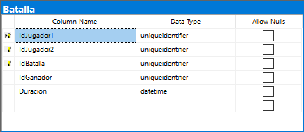
    

    - La clase  *Cartum.cs* me representa una Carta del Juego. En la 
      Base de Datos la tabla esta compuesta por los Campos que se muestran
      en la siguiente imagen:  
       
         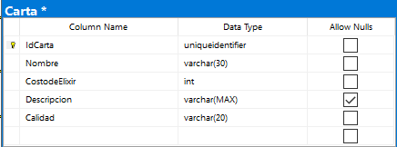


    - La clase *Clan.cs* me representa una Clan del juego 
      en la base de datos el clan queda representado como se muestra en la 
      foto de siguiente: 
        
        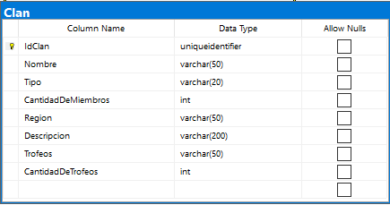
      
    - La clase *Desafio.cs* representa un desafío. En la base de
        datos esta queda representada de la siguiente manera: 
        
        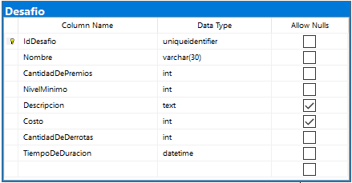

    - La clase *Dispone.cs* es una representación de un
    tabla relacional entre un jugador y una carta. para saber 
    las cartas de las que dispone un jugador. En la base de 
    datos queda representada mediante el diagrama siguiente:

        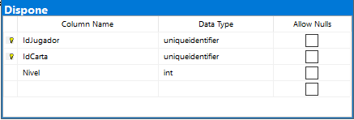 

    
    - La clase *Donar.cs* me representa una donación hecha 
    por una jugador miembro de un clan  de una carta determinada. Es una tabla relacional 
    Y esta representada en la base de datos mediante la siguiente tabla. 
    
        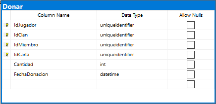

    - La clase *Estructura.cs* me representa una estructura, 
     que es una especialización de Carta. En la base de datos esta queda 
    representada de la siguiente manera: 
        
        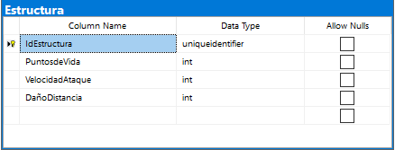

    - La clase *GuerradeClane.cs* me representa una guerra
    que puede ocurrir entre varios clanes

        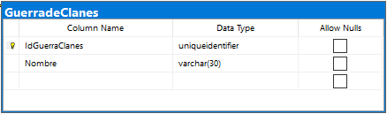

    - La clase *Hechizo.cs*  representa una especialización de Carta . 
     En la base de datos esta esta representada de la siguiente manera. 

        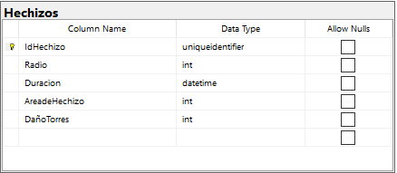

    - La clase *Jugador.cs* me representa un jugador. En la 
    Base de Datos un jugador queda representado mediante la 
    siguiente tabla.
    
        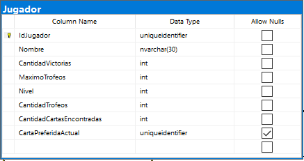

    - La clase *Lucha.cs* me representa una lucha que 
    se puede dar entre dos jugadores. Es una tabla relacional. En la base de datos 
    esta representada mediante la siguiente tabla

        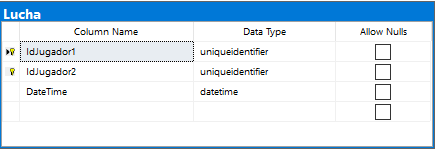 


    
    - La clase  *Miembro.cs* me representa un los miembros
    de los clanes , es decir la relación de los jugadores con los clanes.
    En la base de datos esta relación esta representada mediante la siguiente tabla: 
        
        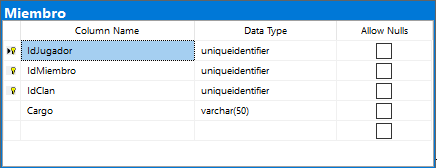     

    - La clase  *Participa.cs* es para representar la participación 
    de un jugador en un desafió. Es un atabla relacional. Su representacion en la 
    base de datso esta dada mediante la siguiente tabla. 

        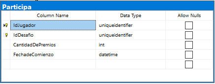 

    - La clase  *ParticipaEn.cs* es para representar la participación 
    de un clan en una guerra. Es una tabla relacional . Esta representada
    en la base de datos de la siguiente manera: 
        
        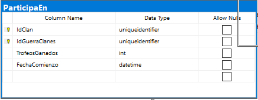

    - La clase *Pertenece.cs* es para representar los jugadores que pertenecen 
    a un clan. Esta relación esta representada en la base de datos 
    mediante la siguiente tabla: 
    
        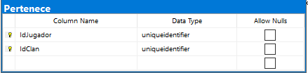

    - La Clase *Tropa.cs* es una especialización de carta. Esta 
      clase esta relacionada con la clase Carta.cs mediante una 
      llave. En la base de datos esta clase queda representada 
      de la siguiente manera: 
        
        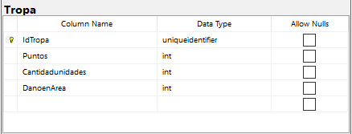

 
    
 - ### Models
    
    Esto me representa los modelos que se usan para 
    representar los objetos que son enviados en los request. 

     
    ```
        Models
            |- CartaModels.cs 
            |- ClanModels.cs 
            |- DesafioModels.cs 
            |- GuerraDeClanesModels.cs 
            |- JugadorModels.cs            
    ```

  - ### Data

    En esta carpeta están todas la interfaces e implementaciones 
    de los datos y las query para manejar la base de datos.
     ```
        Data
            |- ICartaRepository.cs 
            |- IClanRepository.cs 
            |- IDesafioRepository.cs 
            |- IGuerraDeClanesRepository.cs 
            |- IJugadorRepository.cs
            |- ClashRoayaleProfile.cs     
            |- CartaRepository.cs
            |- ClanRepository.cs
            |- DesafioRepository.cs
            |- DonarRepository.cs
            |- JugadorRepository.cs       
    ```
    Lo modelamos así para poder usar la inyección de dependencias. Las interfaces 
    correspondientes a cada clase las nombremos iguales, solo le anadimos la  "*I*" de interfaz 
    delante del nombre.

    Cada una de estos clase tiene metodos para la insercion , eliminacion y busqueda 
    de datos en la base de datos. Estas estructuras son usadas en los controladores para 
    hacer las correspondientes consultas a la base de datos.

 ## Diagrama de la base de datos 

   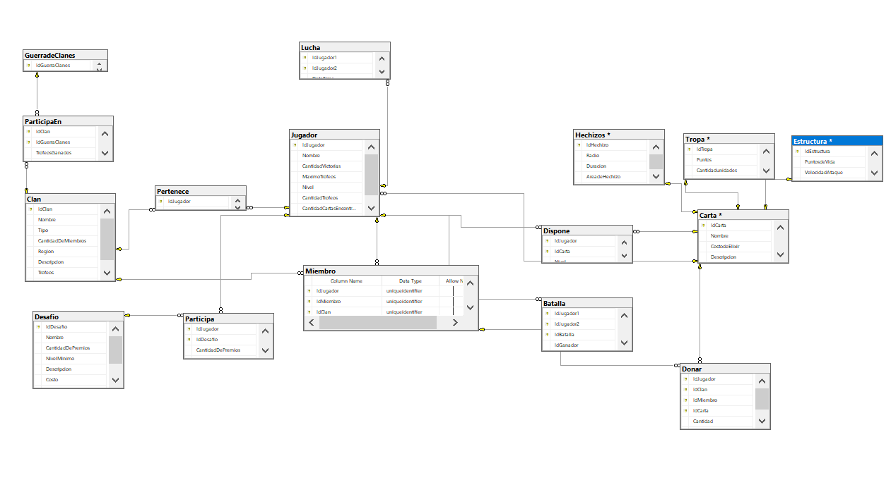